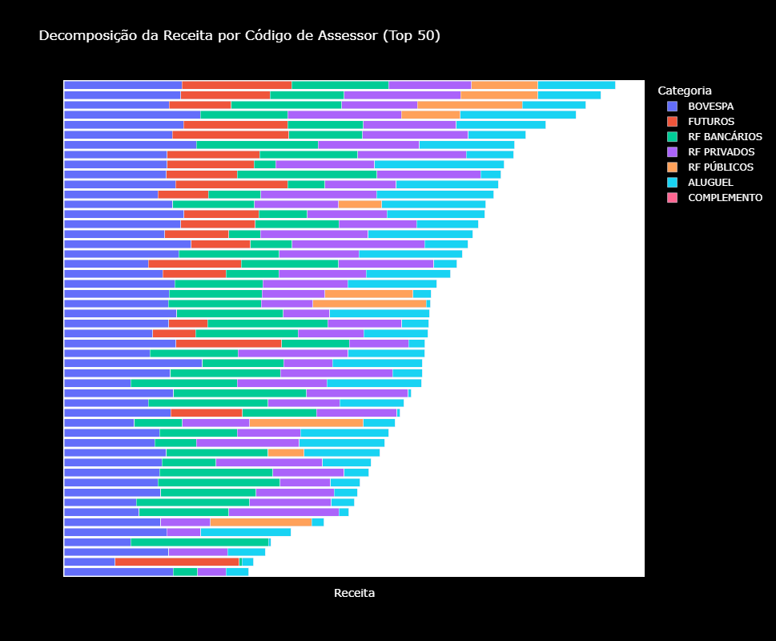

# Py-Bull-Sql

Projeto com template pronto para escritórios de assessoria financeira para coleta, armazenamento e análise de dados de clientes e operações financeiras utilizando Python e SQL.

## Funcionalidades

- Processamento com Python de relatórios extraídos em Excel de maneira automatizada
- Armazenamento de dados em banco SQLite com controle de duplicidade
- Rotinas de manutenção e atualização de dados por meio de triggers e views SQL
- Notebook com análises e visualizações interativas utilizando Plotly e Pandas
- Script de backup automático do banco de dados

### Requisitos

- Python 3.7 ou superior
- Bibliotecas: pandas, numpy, sqlite3, plotly
- SQLite 3.x

### Instalação

1. Clone o repositório:

   ```bash
   git clone https://github.com/luisvinatea/Py-Bull-Sql.git
   cd Py-Bull-Sql
    ```

2. Instale as dependências:

   ```bash
   pip install -r requirements.txt
   ```

3. Configure o banco de dados SQLite conforme necessário. Use o arquivo .env.example como referência.

4. Execute o script de inicialização para criar as tabelas:

   ```bash
   python scripts\database\config\init_database.py
   ```

### Uso

#### Relatório Positivador

```bash
python scripts\upload\tb_positivador.py
```

Realiza o upload dos dados do positivador para o banco de dados SQLite, removendo dados não finalizados do mês atual antes de inserir novos dados.

```python
def delete_non_finished_data(cursor, conn, data_dados):
    """Se data dos dados for diferente do fechamento do mês atual, substituímos os dados do mês atual. Como os relatórios são extraídos em D+2, pode acontecer de no começo do mês termos dados do mês anterior, especificamente se estivermos nos primeiros dois dias úteis do mês. Nesse caso, continuamos atualizando o mês anterior. Uma vez que os dados do mês anterior são finalizados, começamos anexando os dados do mês atual e assim sucessivamente."""
    try:
        # Usando data_dados para determinar qual mês excluir
        if data_dados is None:
            logger.warning("data_dados is None, usando data atual")
            data_date = datetime.datetime.now()
        else:
            # Converte data_dados para datetime
            data_date = datetime.datetime.combine(
                data_dados, datetime.time.min
            )

        # Calcular início do mês dos dados
        month_start = data_date.replace(
            day=1,
            hour=0,
            minute=0,
            second=0,
            microsecond=0,
        )

        # Calcular início do próximo mês
        if data_date.month == 12:
            next_month = data_date.replace(
                year=data_date.year + 1,
                month=1,
                day=1,
                hour=0,
                minute=0,
                second=0,
                microsecond=0,
            )
        else:
            next_month = data_date.replace(
                month=data_date.month + 1,
                day=1,
                hour=0,
                minute=0,
                second=0,
                microsecond=0,
            )

        delete_query = """
            DELETE FROM tb_positivador 
            WHERE data_posicao >= ? AND data_posicao < ?
        """

        # Converter datetime para string format para comparação no SQLite
        month_start_str = month_start.strftime("%Y-%m-%d %H:%M:%S")
        next_month_str = next_month.strftime("%Y-%m-%d %H:%M:%S")

        logger.info(
            f"Tentando deletar registros entre {month_start_str} e {next_month_str}"
        )

        cursor.execute(delete_query, (month_start_str, next_month_str))
        deleted_count = cursor.rowcount
        conn.commit()

        logger.info(
            f"Removidos {deleted_count:,} registros do mês {data_date.strftime('%Y-%m')} da tabela no banco de dados."
        )
        return True

    except Exception as e:
        logger.error(f"Erro ao remover dados não concluídos: {e}")
        return False
        return False
```

#### Tabela de Rastreamento de Arquivos

```sql
CREATE TABLE tb_rastreamento_arquivos (
    id INTEGER PRIMARY KEY AUTOINCREMENT,
    nome_arquivo TEXT NOT NULL,
    data_upload TIMESTAMP DEFAULT CURRENT_TIMESTAMP,
    status TEXT NOT NULL
);
```

Todos os scripts de upload utilizam essa tabela para verificar se o arquivo foi modificado desde a última execução, evitando reprocessamento desnecessário.

```python
def should_process_file(
    cursor, file_name, table_name, current_modified_time, data_dados
):
    """Verifica se um arquivo deve ser processado com base em sua data de modificação."""
    try:
        cursor.execute(
            "SELECT ultima_modificacao FROM tb_rastreamento_arquivos WHERE nome_arquivo = ?",
            (file_name,),
        )
        result = cursor.fetchone()

        if result is None:
            logger.info(f"Arquivo {file_name} nunca foi processado antes.")
            cursor.execute(
                "SELECT data_posicao FROM tb_positivador WHERE data_posicao = ?",
                (data_dados,),
            )
            if data_dados is not None and cursor.fetchone() is not None:
                logger.info(
                    f"Dados para a data {data_dados} já existem na tabela. Pulando processamento."
                )
                return False
            return True

        last_processed_time = result[0]

        # Converter string para datetime se necessário
        if isinstance(last_processed_time, str):
            # Tentar parsing com microsegundos primeiro, depois sem
            try:
                last_processed_time = datetime.datetime.strptime(
                    last_processed_time, "%Y-%m-%d %H:%M:%S.%f"
                )
            except ValueError:
                last_processed_time = datetime.datetime.strptime(
                    last_processed_time, "%Y-%m-%d %H:%M:%S"
                )

        time_diff = abs(
            (current_modified_time - last_processed_time).total_seconds()
        )

        if time_diff > 1:
            logger.info(
                f"Arquivo {file_name} foi modificado desde a última execução."
            )
            return True
        else:
            logger.info(
                f"Arquivo {file_name} não foi modificado. Pulando processamento."
            )
            return False

    except Exception as e:
        logger.error(f"Erro ao verificar status do arquivo {file_name}: {e}")
        return True


def update_file_tracking(cursor, conn, file_name, table_name, modified_time):
    """Atualiza ou insere registro de rastreamento de arquivo."""
    try:
        cursor.execute(
            """UPDATE tb_rastreamento_arquivos 
               SET ultima_modificacao = ?, ultimo_processamento = datetime('now') 
               WHERE nome_arquivo = ?""",
            (modified_time, file_name),
        )

        if cursor.rowcount == 0:
            cursor.execute(
                """INSERT INTO tb_rastreamento_arquivos (nome_arquivo, nome_tabela, ultima_modificacao, ultimo_processamento) 
                   VALUES (?, ?, ?, datetime('now'))""",
                (file_name, table_name, modified_time),
            )

        conn.commit()
        logger.info(f"Rastreamento atualizado para {file_name}")

    except Exception as e:
        logger.error(
            f"Erro ao atualizar rastreamento do arquivo {file_name}: {e}"
        )
```

#### Views Dinâmicas

Dados consolidados de clientes com data de ativação do marco de 300K em captação líquida acumulada:

```sql
CREATE VIEW vw_clientes AS
WITH
    -- Passo 1: Usar funções de janela em vez de subconsultas correlacionadas
    net_captacao_window AS (
        SELECT
            codigo_cliente,
            DATE(data_posicao, 'start of month') AS data_referencia,
            captacao_liquida_em_m,
            -- Encontrar o último ponto de reset usando função de janela
            MAX(
                CASE
                    WHEN captacao_liquida_em_m >= 300000 THEN DATE(data_posicao, 'start of month')
                END
            ) OVER (
                PARTITION BY
                    codigo_cliente
                ORDER BY
                    DATE(data_posicao, 'start of month') ROWS UNBOUNDED PRECEDING
            ) AS last_reset_date,
            -- Calcular soma acumulada com lógica de reset apropriada
            CASE
                WHEN captacao_liquida_em_m >= 300000 THEN captacao_liquida_em_m
                ELSE SUM(captacao_liquida_em_m) OVER (
                    PARTITION BY
                        codigo_cliente
                    ORDER BY
                        DATE(data_posicao, 'start of month') ROWS UNBOUNDED PRECEDING
                )
            END AS captacao_liq_acumulada_temp
        FROM
            tb_positivador
        WHERE
            captacao_liquida_em_m IS NOT NULL
            AND codigo_cliente IS NOT NULL
    ),
    -- Passo 2: Aplicar lógica de reset apropriada
    net_captacao_cumulative AS (
        SELECT
            codigo_cliente,
            data_referencia,
            captacao_liquida_em_m,
            CASE
                WHEN captacao_liquida_em_m >= 300000 THEN captacao_liquida_em_m
                ELSE SUM(
                    CASE
                        WHEN last_reset_date IS NULL
                        OR data_referencia > last_reset_date THEN captacao_liquida_em_m
                        ELSE 0
                    END
                ) OVER (
                    PARTITION BY
                        codigo_cliente
                    ORDER BY
                        data_referencia ROWS UNBOUNDED PRECEDING
                )
            END AS captacao_liq_acumulada
        FROM
            net_captacao_window
    ),
    -- Passo 3: Encontrar a primeira data em que cada conta atingiu 300K (spike único ou acumulado até reset)
    ativacao_300k_dates AS (
        SELECT
            codigo_cliente,
            MIN(data_referencia) AS data_ativacao_300k
        FROM
            net_captacao_cumulative
        WHERE
            captacao_liq_acumulada >= 300000
        GROUP BY
            codigo_cliente
    ),
    -- Passo 5: Obter dados do cliente com assessor atual
    client_data AS (
        SELECT DISTINCT
            positivador.codigo_cliente,
            saldo.nome_cliente,
            positivador.profissao,
            positivador.sexo,
            positivador.segmento,
            DATE(positivador.data_nascimento) AS data_nascimento,
            rv.suitability,
            DATE(positivador.data_cadastro, 'start of month') AS data_cadastro,
            CASE
                WHEN positivador.ativou_em_m = 'Sim' THEN DATE(positivador.data_posicao, 'start of month')
                ELSE NULL
            END AS data_ativacao,
            CASE
                WHEN positivador.evadiu_em_m = 'Sim' THEN DATE(positivador.data_posicao, 'start of month')
                ELSE NULL
            END AS data_evasao,
            positivador.aplicacao_financeira_declarada_ajustada AS patrimonio_declarado,
            CASE
                WHEN tipo_pessoa = 'PESSOA JURÍDICA' THEN 'PJ'
                ELSE 'PF'
            END AS tipo_pessoa,
            positivador.codigo_assessor
        FROM
            tb_positivador positivador
            LEFT JOIN tb_saldo saldo ON positivador.codigo_cliente = saldo.codigo_cliente
            LEFT JOIN tb_ordens_rv rv ON positivador.codigo_cliente = rv.codigo_cliente
    )
    -- SELECT final
SELECT
    cd.codigo_cliente,
    cd.nome_cliente,
    cd.profissao,
    cd.sexo,
    cd.segmento,
    cd.data_nascimento,
    cd.suitability,
    cd.data_cadastro,
    cd.data_ativacao,
    a300.data_ativacao_300k,
    cd.data_evasao,
    cd.patrimonio_declarado,
    cd.tipo_pessoa,
    cd.codigo_assessor
FROM
    client_data cd
    LEFT JOIN ativacao_300k_dates a300 ON cd.codigo_cliente = a300.codigo_cliente
WHERE
    cd.codigo_cliente IS NOT NULL
    AND cd.nome_cliente IS NOT NULL;
```

Resultados por Assessor de Investimentos:

```sql
CREATE VIEW vw_aai AS
WITH
    positivador_agg AS (
        SELECT
            DATE(data_posicao, 'start of month') AS data_referencia,
            codigo_assessor,
            -- Custodia
            SUM(COALESCE(net_em_m, 0)) AS net_total,
            -- Custodia por categorias
            SUM(COALESCE(net_renda_fixa, 0)) AS net_renda_fixa,
            SUM(COALESCE(net_fundos_imobiliarios, 0)) AS net_fundos_imobiliarios,
            SUM(COALESCE(net_renda_variavel, 0)) AS net_renda_variavel,
            SUM(COALESCE(net_fundos, 0)) AS net_fundos,
            SUM(COALESCE(net_financeiro, 0)) AS net_financeiro,
            SUM(COALESCE(net_previdencia, 0)) AS net_previdencia,
            SUM(COALESCE(net_outros, 0)) AS net_outros,
            -- Captação
            SUM(COALESCE(captacao_bruta_em_m, 0)) AS captacao_bruta_total,
            SUM(COALESCE(resgate_em_m, 0)) AS resgate_total,
            SUM(COALESCE(captacao_liquida_em_m, 0)) AS captacao_liquida_total,
            -- Captação por canais
            SUM(COALESCE(captacao_ted, 0)) AS captacao_ted_total,
            SUM(COALESCE(captacao_st, 0)) AS captacao_st_total,
            SUM(COALESCE(captacao_ota, 0)) AS captacao_ota_total,
            SUM(COALESCE(captacao_rf, 0)) AS captacao_rf_total,
            SUM(COALESCE(captacao_td, 0)) AS captacao_td_total,
            SUM(COALESCE(captacao_prev, 0)) AS captacao_prev_total,
            -- Receita
            SUM(COALESCE(receita_no_mes, 0)) AS receita_bruta_total,
            -- Receita por categorias
            SUM(COALESCE(receita_bovespa, 0)) AS receita_bovespa_total,
            SUM(COALESCE(receita_futuros, 0)) AS receita_futuros_total,
            SUM(COALESCE(receita_rf_bancarios, 0)) AS receita_rf_bancarios_total,
            SUM(COALESCE(receita_rf_privados, 0)) AS receita_rf_privados_total,
            SUM(COALESCE(receita_rf_publicos, 0)) AS receita_rf_publicos_total,
            SUM(COALESCE(receita_aluguel, 0)) AS receita_aluguel_total,
            SUM(
                COALESCE(receita_complemento_pacote_corretagem, 0)
            ) AS receita_complemento_total,
            -- Clientes
            SUM(
                CASE
                    WHEN ativou_em_m = 'Sim' THEN 1
                    ELSE 0
                END
            ) AS clientes_novos,
            SUM(
                CASE
                    WHEN evadiu_em_m = 'Sim' THEN 1
                    ELSE 0
                END
            ) AS clientes_perdidos,
            SUM(
                CASE
                    WHEN sexo IS NULL THEN 1
                    ELSE 0
                END
            ) AS clientes_pj,
            SUM(
                CASE
                    WHEN sexo IS NOT NULL THEN 1
                    ELSE 0
                END
            ) AS clientes_pf
        FROM
            tb_positivador
        GROUP BY
            DATE(data_posicao, 'start of month'),
            codigo_assessor
    ),
    ordens_rf_agg AS (
        SELECT
            DATE(data_ordem, 'start of month') AS data_referencia,
            codigo_assessor,
            ABS(SUM(COALESCE(volume, 0))) AS volume_operado_rf
        FROM
            tb_ordens_rf
        GROUP BY
            DATE(data_ordem, 'start of month'),
            codigo_assessor
    ),
    ordens_rv_agg AS (
        SELECT
            DATE(data_ordem, 'start of month') AS data_referencia,
            codigo_assessor,
            ABS(SUM(COALESCE(volume, 0))) AS volume_operado_rv
        FROM
            tb_ordens_rv
        GROUP BY
            DATE(data_ordem, 'start of month'),
            codigo_assessor
    ),
    saldo_agg AS (
        SELECT
            DATE(data_saldo, 'start of month') AS data_referencia,
            codigo_assessor,
            SUM(COALESCE(saldo_total, 0)) AS saldo_cliente_total,
            AVG(COALESCE(saldo_total, 0)) AS saldo_cliente_medio
        FROM
            tb_saldo
        GROUP BY
            DATE(data_saldo, 'start of month'),
            codigo_assessor
    )
SELECT
    p.data_referencia,
    p.codigo_assessor,
    -- Custodia
    p.net_total,
    p.net_renda_fixa,
    p.net_fundos_imobiliarios,
    p.net_renda_variavel,
    p.net_fundos,
    p.net_financeiro,
    p.net_previdencia,
    p.net_outros,
    -- Captação
    p.captacao_bruta_total,
    p.resgate_total,
    p.captacao_liquida_total,
    p.captacao_ted_total,
    p.captacao_st_total,
    p.captacao_ota_total,
    p.captacao_rf_total,
    p.captacao_td_total,
    p.captacao_prev_total,
    -- Receita
    p.receita_bruta_total,
    p.receita_bovespa_total,
    p.receita_futuros_total,
    p.receita_rf_bancarios_total,
    p.receita_rf_privados_total,
    p.receita_rf_publicos_total,
    p.receita_aluguel_total,
    p.receita_complemento_total,
    -- Clientes
    p.clientes_novos,
    p.clientes_perdidos,
    p.clientes_pj,
    p.clientes_pf,
    -- Ordens
    COALESCE(rf.volume_operado_rf, 0) AS volume_operado_rf,
    COALESCE(rv.volume_operado_rv, 0) AS volume_operado_rv,
    -- Saldo Clientes
    COALESCE(s.saldo_cliente_total, 0) AS saldo_cliente_total,
    COALESCE(s.saldo_cliente_medio, 0) AS saldo_cliente_medio
FROM
    positivador_agg p
    LEFT JOIN ordens_rf_agg rf ON p.data_referencia = rf.data_referencia
    AND p.codigo_assessor = rf.codigo_assessor
    LEFT JOIN ordens_rv_agg rv ON p.data_referencia = rv.data_referencia
    AND p.codigo_assessor = rv.codigo_assessor
    LEFT JOIN saldo_agg s ON p.data_referencia = s.data_referencia
    AND p.codigo_assessor = s.codigo_assessor;
```

#### Triggers para Controle de Categorias

```sql
CREATE TRIGGER IF NOT EXISTS trg_cadastro_ativos_rf
AFTER INSERT ON tb_ordens_rf
FOR EACH ROW
WHEN NEW.tipo_ativo IS NOT NULL 
    AND NEW.tipo_ativo NOT IN (SELECT tipo_ativo FROM tb_ativos)
BEGIN
    INSERT INTO tb_ativos (tipo_ativo, categoria)
    VALUES (NEW.tipo_ativo, 'Renda Fixa');
END;

CREATE TRIGGER IF NOT EXISTS trg_cadastro_ativos_rv
AFTER INSERT ON tb_ordens_rv
FOR EACH ROW
WHEN NEW.tipo_produto IS NOT NULL
    AND NEW.tipo_produto NOT IN (SELECT tipo_ativo FROM tb_ativos)
BEGIN
    INSERT INTO tb_ativos (tipo_ativo, categoria)
    VALUES (NEW.tipo_produto, 'Renda Variável');
END;
```

#### Índices para Performance

```sql
CREATE INDEX IF NOT EXISTS idx_tb_positivador_assessor_data ON tb_positivador (codigo_assessor, data_posicao);

CREATE INDEX IF NOT EXISTS idx_tb_positivador_data_posicao ON tb_positivador (data_posicao);

-- tb_ordens_rf
CREATE INDEX IF NOT EXISTS idx_tb_ordens_rf_assessor_data ON tb_ordens_rf (codigo_assessor, data_ordem);

CREATE INDEX IF NOT EXISTS idx_tb_ordens_rf_data_ordem ON tb_ordens_rf (data_ordem);

-- tb_ordens_rv
CREATE INDEX IF NOT EXISTS idx_tb_ordens_rv_assessor_data ON tb_ordens_rv (codigo_assessor, data_ordem);

CREATE INDEX IF NOT EXISTS idx_tb_ordens_rv_data_ordem ON tb_ordens_rv (data_ordem);

-- tb_saldo
CREATE INDEX IF NOT EXISTS idx_tb_saldo_assessor_data ON tb_saldo (codigo_assessor, data_saldo);

CREATE INDEX IF NOT EXISTS idx_tb_saldo_data_saldo ON tb_saldo (data_saldo);
```

#### Notebook de Análises e Visualizações

```bash
notebooks\insights.ipynb
```



#### Script de Backup Automático

```bash
scripts\utils\backup.py
```

```python
def save_table_to_excel(df: pd.DataFrame, output_file: Path, table_name: str):
    """Salva um DataFrame em Excel com formatação apropriada"""
    try:
        with pd.ExcelWriter(output_file, engine="xlsxwriter") as writer:
            df.to_excel(writer, index=False, sheet_name="Sheet1")

            workbook = writer.book
            worksheet = writer.sheets["Sheet1"]
            text_format = workbook.add_format({"num_format": "@"})

            # formatação de colunas com valores numéricos muito grandes
            for idx, col in enumerate(df.columns):
                if df[col].dtype == "object":
                    sample_values = df[col].dropna().head(100)
                    if len(sample_values) > 0:
                        try:
                            numeric_check = pd.to_numeric(
                                sample_values, errors="coerce"
                            )
                            max_val = numeric_check.abs().max()
                            if pd.notna(max_val) and max_val >= 1e9:
                                worksheet.set_column(
                                    idx, idx, None, text_format
                                )
                        except Exception:
                            pass

        logger.info(f"Arquivo salvo: {output_file} ({len(df)} linhas)")
        return True
    except Exception as e:
        logger.error(f"Erro ao salvar arquivo {output_file}: {e}")
        return False


def extract_and_backup_table(
    db_path: Path, table_name: str, backup_dir: Path
) -> dict:
    """Extrai tabela do banco e cria backup completo e por data"""
    stats = {
        "table_name": table_name,
        "total_rows": 0,
        "full_backup_created": False,
        "files_created": 0,
        "errors": 0,
    }

    # Extrai tabela
    df = extract_table_from_database(db_path, table_name)
    if df is None or len(df) == 0:
        logger.warning(f"Tabela '{table_name}' vazia ou não pôde ser extraída")
        return stats

    stats["total_rows"] = len(df)

    # cria diretório da tabela
    table_dir = backup_dir / table_name
    table_dir.mkdir(parents=True, exist_ok=True)

    # Salva backup completo
    full_backup_file = table_dir / f"{table_name}_backup_completo.xlsx"
    if save_table_to_excel(df, full_backup_file, table_name):
        stats["full_backup_created"] = True
    else:
        stats["errors"] += 1

    # Verifica coluna de data
    date_column = get_table_date_column(table_name)
    if not date_column or date_column not in df.columns:
        logger.info(
            f"Tabela '{table_name}' não possui coluna de data configurada. Apenas backup completo criado."
        )
        return stats

    # Divide por data
    logger.info(
        f"Dividindo tabela '{table_name}' por datas na coluna '{date_column}'"
    )

    # Converte para datetime
    df[date_column] = pd.to_datetime(df[date_column], errors="coerce")
    invalid_dates = df[date_column].isnull().sum()

    if invalid_dates > 0:
        logger.warning(
            f"{invalid_dates} linhas com datas inválidas em '{table_name}'"
        )

    df_clean = df.dropna(subset=[date_column])

    if len(df_clean) == 0:
        logger.warning(f"Nenhuma data válida encontrada em '{table_name}'")
        return stats

    unique_dates = df_clean[date_column].dt.date.unique()
    logger.info(
        f"Encontradas {len(unique_dates)} datas únicas em '{table_name}'"
    )

    for date in sorted(unique_dates):
        date_str = date.strftime("%Y-%m-%d")
        year_str = date.strftime("%Y")
        month_str = date.strftime("%m")

        # Cria estrutura de diretórios ano/mês
        output_dir = table_dir / year_str / month_str
        output_dir.mkdir(parents=True, exist_ok=True)

        output_file = output_dir / f"{table_name}_{date_str}.xlsx"

        df_date = df_clean[df_clean[date_column].dt.date == date].copy()

        # Converte colunas datetime para apenas data
        for col in df_date.columns:
            if pd.api.types.is_datetime64_any_dtype(df_date[col]):
                df_date[col] = df_date[col].dt.date

        if save_table_to_excel(df_date, output_file, table_name):
            stats["files_created"] += 1
        else:
            stats["errors"] += 1

    return stats
```

### Contribuição

Contribuições são bem-vindas! Sinta-se à vontade para abrir issues ou pull requests com melhorias, correções de bugs ou novas funcionalidades.

### Licença

Este projeto está licenciado sob a Licença MIT. Veja o arquivo LICENSE para mais detalhes.
